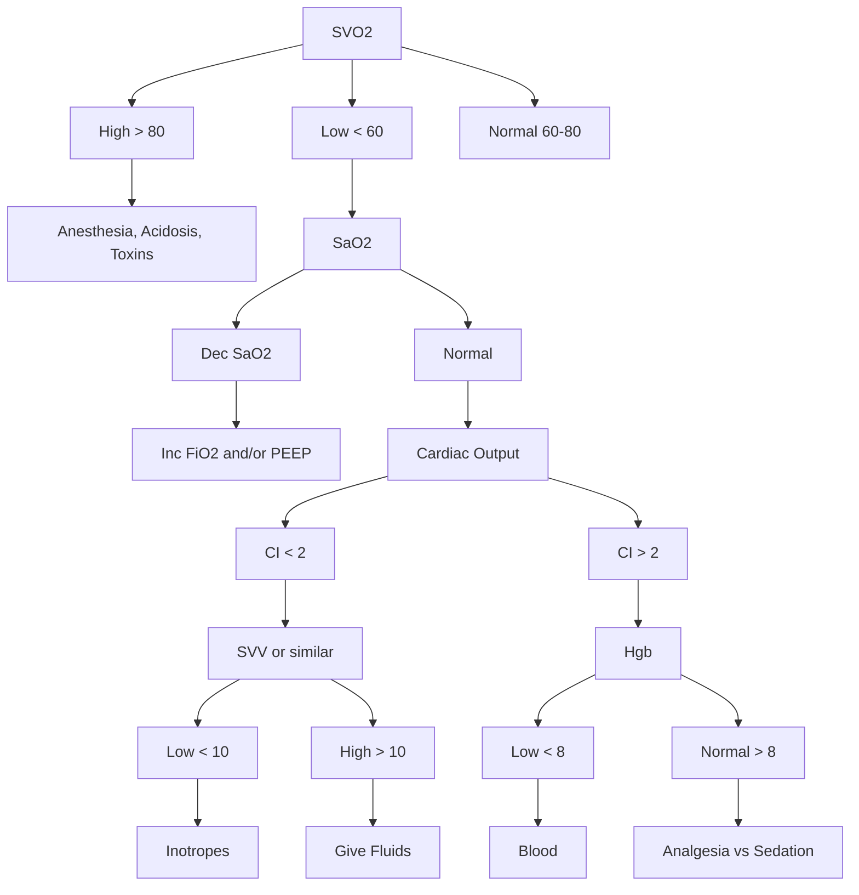

## Starling Curve!

## Subclavian Steal

## SVO2 Interpretation
  

$$
SvO_2 = {SaO_2} - {VO_2 \over 1.38 * 10 * CO * Hgb}
$$

```mermaid
flowchart 
    
    A[SVO2] --> C[High > 80]
    A[SVO2] --> D[Low  < 60]
    A[SVO2] --> B[Normal 60-80]
    C --> E[Anesthesia, Acidosis, Toxins]
    D --> F[SaO2]
    F --> G[Normal]
    F --> H[Dec SaO2]
    H --> I[Inc FiO2 and/or PEEP]
    G --> J[Cardiac Output]
    J --> K[CI < 2]
    J --> L[CI > 2]
    K --> M[SVV or similar]
    M --> N[Low < 10]
    M --> U[High > 10]
    U --> V[Give Fluids]
    N --> O[Inotropes]
    L --> P[Hgb]
    P --> Q[Low < 8]
    Q --> R[Blood]
    P --> S[Normal > 8]
    S --> T[Analgesia vs Sedation]
```
