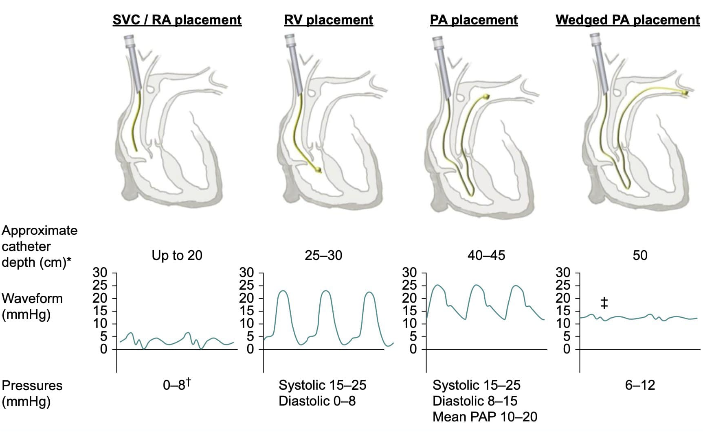
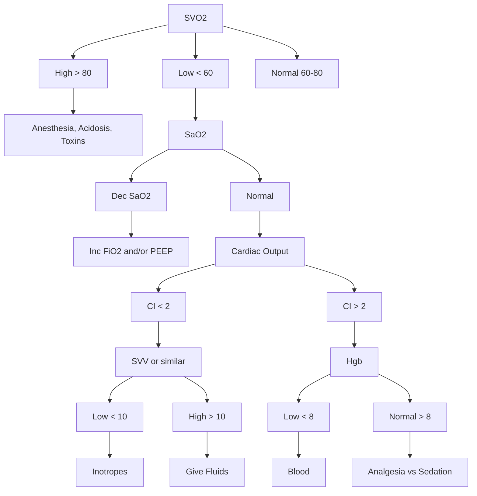

## Cardiac and Respiratory

### Ficks Law of Diffusion

Blood to organ can be calculated using a marker substance if the amount of marker uptake per time, concentration venous and arterial of marker are known.

$$
CO = {\dot VO_2 \over Ca - Cv} = {(125ml/min) * (BSA) \over CaO_2 - CvO_2}
$$

$$
Oxygen Carrying Capacity = CaO_2 = {(Hgb * SaO_2 * 1.34) + (PaO_2 * 0.003)}
$$

### Law of Laplace

#### Arteries and AAA

The assumption is that the structure described is cylindrical. 

$$
Wall Tension (Cylinder) = {Pressure * Radius \over Wall Thickness}
$$

#### Left Ventricle and Alveoli

The assumption is that the structure described is spherical. Surfactant does help to lower the surface tension in the alveoli. 

$$
Wall Tension (Sphere) = {Pressure * Radius \over 2 *  Wall Thickness}
$$

### Poiseuille's Law for Flow or Resistance

The original law was presented for flow through a cylinder. If the equation is rearranged it represents resistance through that cylinder. Both are described below. 

#### Flow

$$
Q = {\pi r^4 \over 8L\eta }{(\Delta P)}
$$

#### Resistance

$$
R = {8L\eta \over \pi r^4 }{(\Delta P)}
$$

### Systemic Vascular Resistance SVR

$$
SVR = {MAP- CVP \over CO }{(80)}
$$

## Starling Curve!

## Subclavian Steal

## CVSpecificMonitors{CV}

### CVP

- Loss of a Wave: 
  - A fib or V pacing without atrial contraction
- Large a Wave: 
  - Atria emptying against high resistance
  - Tricuspid stenosis, diastolic dysfx, ischemic heart, RVH, AV dissociation, junctional, V paced, PVC
- Large v Wave:
  - Tricuspid regurg

### PA Catheter

#### When PAOP Does NOT Predict LVEDV

- Overestimates
  - Impaired LV compliance ie. ischemia
  - Mitral valve disease
  - Left to right cardiac shunt
  - Tachycardia
  - PPV
  - PEEP
  - COPD
  - Pulmonary hypertension
  - Non west zone III placement of PAC
- Underestimates
  - Aortic insufficiency

### SVO2 Interpretation
  

$$
SvO_2 = {SaO_2} - {VO_2 \over 1.38 * 10 * CO * Hgb}
$$

### EKG

## EKG Basics

For a great video lecture series about 2.75 hrs long check out [EKG interpretation Video Lectures](https://litfl.com/ecg-interpretation-video-lectures/)

## The Rule of Fours

### Four Initial Features

#### History and Clinical Picture

Clinical picture is arguabley the most important part. History taking is also important but clinical features can be quite informative.

#### Rate

Normal 60-100. Not too fast or too slow!

#### Rhythm

Hopefully sinus...but it can be anything! How do you know? First it's a good idea to know some rhythms and then work through the EKG in an organized manner. You already have the rate so it's fast, slow, or normal. Next:

1. Regular or irregular R-R
2. P wave with every QRS
3. QRS with every P
4. PR interval
5. QRS Interval
6. Ectopy
7. Identify!

#### Axis

Normal axis is -30 to + 90.

##### Axis Deviation In Depth

Check out [Life In The Fast Lane](https://litfl.com/) for tons of EKG knowledge and examples!

For an in depth analysis of axis deviation check out [EKG Axis Interpretation](https://litfl.com/ecg-axis-interpretation/)

Ever wonder how the axis is calculated? You use the axis circle and draw vectors. These vectors are summed using the x intercept and the intersection point on the circle. This new vector is the axis deviation! For a thorough explanation and more examples check out [Super Axis Man SAM](https://litfl.com/super-axis-man-sam/)

### Four Waves

#### P

Check out lead II for the best P wave morphology!

#### QRS

Look in all leads for the presence of Q waves. Also note the QRS amplitude and R wave progression in leads V1-V6.

#### T

Look in all leads for the presence of T waves. Be sure to note any inverstion, flattening, and the concordance vs discordance with the QURS complex.

#### U

Are the U waves present or not?

### Four Intervals

#### PR

Normal is 0.12-0.2 seconds or 3-5 little squares. Longer means a first degree heart block, but shorter can be mean WPW, junctional rhythms, and some syndromes.

#### QRS

Normal is 0.12seconds or less or less than 3 little squares. Widened QRS indicates a conduction defect or delay.

#### ST

This can be the most important thing at which to look!

#### QT

Easiest to use the EKG machine measurements and ensure it is not prolonged! ( QT > 450)
