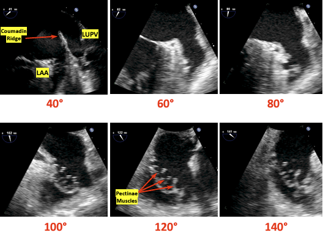
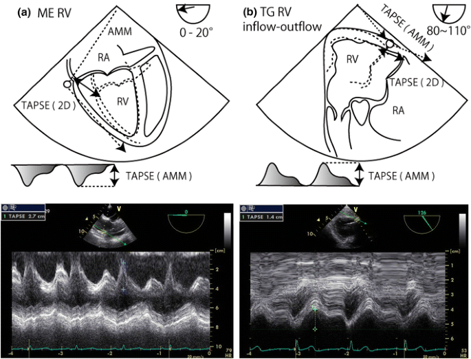

## Resources

Practical Approach to Transesophageal Echocardiography 4th edition by Scott Reeves and Albert Perrino Jr.

[TTE Guide PDF](https://www.asecho.org/guideline/guidelines-for-performing-a-comprehensive-transthoracic-echocardiographic-examination-in-adults/)

[TEE Practice](https://pie.med.utoronto.ca/TEE/TEE_content/TEE_standardViews_intro.html)

## Ultrasound Physics

The basics of ultrasound:

- Sound waves vibrating off of structures travelling through a media
- 2-10Mhz (Human hearing < 20,000hz)
- Electrodes stimulate ceramic pizoelectric crystals which both vibrate and receive incoming vibrations.
  - Electricity causes trapped polarized molecules to vibrate
- Better resolution with increased frequency
- Ultrasound produces reflection, scatter, and refraction which can alter your image or fool you into thinking something is present when it actually is not.
- Image gets worse with increased distance from the probe and the structure: dispersion
- Heat is the absorption of the ultrasound waves and with enough time can cause burns

## Complications of TEE

1. Oropharyngeal: lips, teeth, gum damage, laceration, perforation, tracheal intubation
2. Esophageal: Odynophagia, dysphagia laceration, perforation
3. Gastric: Laceration, perforation
4. Misc: Airway compromise, thermal injury, tongue necrosis

## Absolute Contradindications of TEE

1. Perforated viscous
2. Esophageal pathology
3. Active GI bleed
4. Recent upper GI surgery
5. Esophagectomy or gastric bypass surgery

## Relative Contradindications of TEE

1. Atlantoaxial joint disease
2. Severe cervical arthritis
3. Chest radiation
4. Hiatal hernia
5. GI surgery history
6. Recent GI bleed
7. Dysphagia or peptic ulcer history
8. Coagulopathy

## Exam Overview

Basic TEE views and their anatomy. From: Basic Perioperative Transesophageal
Echocardiography Examination: A Consensus Statement of the American Society of Echocardiography and the Society of Cardiovascular Anesthesiologists (J Am Soc Echocardiogr 2013;26:443-56.) Also from Dr. Ricardo J. Benenstein: Basic TEE Protocol NYU Langone Medical Center

### TEE Probe Angle and Depth

This is a great summary of angles if you have trouble visualizing them.

### Rate and Rhythm

Dysrhythmias can make LV function analysis both in systole and diastole anomalus. This can also happen with simple brady or tachycardias.

### Mid Esophageal Views

#### ME Four-Chamber View

- The ME four-chamber view is obtained by advancing the probe to a depth of approximately 35 cm. You may need to advance slightly to bring the true apex into view. A slight retroflexion may be required to align the MV and LV apex. 
- This view is used to assess global function of the LV and RV, MV and TV function, and shunt flow if present. To assess valve function and shunt flow use color doppler with a Nyquist limit of 50-60cm/sec.
- Sometimes image optimization is difficult due to patient anatomy and it is easier to split this into an "LV-focused" view and an "RV-focused" view by simply rotating to the left and right.
- Often at 0 degrees of omniplane, a 5 chamber view will be obtained with the LVOT and part of the aortic valve imaged. In this scenario the omniplane can be increased slightly (usually no more than 20-30 degrees) to obtain a more true 4 chamber view.

#### Coronary Sinus

Slightly advance the probe until you lose sight of some left sided structures and you begin to see the inferior vena cava and CS.

#### ME Two-Chamber 60 View

From the four chamber view rotate your angle to approx. 60 degrees to where you no longer see any right sided structures. You may need to rotate counter clockwise.

#### ME Two-Chamber 90 View

- From the four chamber view rotate your angle to approx. 90 degrees to where you no longer see any right sided structures. This view gives a different perspective on LV and MV function.
- The left atrial appendage is often viewed best from this view (though sometimes with slightly less omniplane and can be interrogated for clot presence.
- At 90 degrees of omniplane, the anterior wall of the LV will be displayed on screen right and the inferior wall on screen left.

#### ME Long-Axis (LAX) 120 View

- From the ME two-chamber view, rotate to 110-150 until the LVOT and AV come into view. You can now examine pathology in the LVOT, AV, MV, and LV.
- Frequently this image will be obtained best at a higher angle than 120 (often 130-150). The trick is to optimize the cavity size of the LV as well as the LVOT and aortic root.

#### Left Atrial Appendage Views

#### ME AV Short Axis and RV inflow outflow

- This is a great anatomical and echo summary of the ME and UE views of the great vessels and superior heart structures.

- From any ME view, change your angle to 45 degrees and slowly advance or pullback until the AV comes into view. You may need to rotate clockwise. It should look similar to a Mercedes logo. To find the RV inflow outflow views adjust your angle to 60-90 and move the probe to keep the AV in view. Change the probe depth or rotation to focus on the TV or PV. Utilize color doppler for valve analysis.
- The three cusps are labeled to the left. The non-coronary cusp is always adjacent to the interatrial septum and the right-coronary cusp is at the bottom of the screen adjacent to the RVOT as imaged. The left-cusp is usually identified as "last-but-not-least".

#### ME Ascending Aortic SAX View

- Withdraw the probe slightly and change the angle to 0-20. This should bring the main PA and bifurcation into view. The right PA will be on top.
- If simply looking for the MPA, I find this view easier to obtain by starting with a ME aortic valve short axis view (below), slowly retracting the probe until the valve disappears and all that is imaged is the ascending aorta, and then gently retroflexing until the RPA and MPA are seen.

#### ME Ascending Aortic LAX View

- From the ME Aortic SAX change the angle to 90. You can also withdraw the probe from the ME LAX viewto see the LAX of the ascending aorta. This can count as an UE view due to withdrawing the probe.
- From the ME Long Axis view ~120, focus on the aortic root and begin slowly withdrawing the probe to image the more superior ascending aorta. The right pulmonary artery will be seen in cross section between the ultrasound transducer and the aorta.
- Careful counter-clockwise rotation from this view will allow imaging of the main pulmonary artery and pulmonic valve, often with good alignment for doppler interrogation

#### ME Bicaval View

- From the ME RV inflow-outflow view rotate 90-110 and slightly clockwise. The RA and vena cavas should be in view. 
- This is particularly helpful when placing venous access wires or ECMO/CBP cannulas.

The first image orients you with body while the following image is more detailed with the structures visualized.

### Transgastric Views TG

#### TG Midpapillary SAX View

From the ME four-chamber view advance into the stomach and anteflexed to come in contact with the gastric wall. Slowly advance until you can see both papillary muscles. Visualization of the MV leaflet chords indicates that the probe should be advanced, whereas not visualizing any papillary muscles indicates that the probe is too deep.
Once the posteromedial papillary muscle is in view, visualization of the anterolateral papillary muscle is optimized by varying the degree of anteflexion. If MV leaflet chords are seen, anteflexion should be decreased, whereas not visualizing any papillary muscles indicates that anteflexion should be increased. This view is very popular for intraoperative monitoring.

#### TG Deep LAX View

This view is used for aortic valve measurments due to the LVOT and AV being lined up with probe. The cosine of the doppler angle is still a factor but significantly diminished as oppposed to the ME 120 degree view.

#### TG Basal View

This view is used in MV analysis specifically planimetry for the area of the MV opening among others.

### Descending Aortic SAX and LAX Views

This selection of views is helpful in aneurysms and dissections. It is also quite useful when placing intra-aortic balloon pumps and arterial cannulas for ECMO or CPB. Rotate teh probe couterclockwise from the ME Four Chamber view to locate the aorta and then advance for more descending or withdrawn for arch and ascending views. Use the X-Plane mode for 90 degree view or just move your angle to 90 as needed.

### End of Exam

Make sure to unlock the probe and withdraw it slowly. Check the probe for signs of bleeding.

## Advanced TEE

### LV Systolic Function

In normal hearts the Teicholz equation is accurate, but for hearts suffering from infaractions past or present the disc method using Simpson's Rule is preferred.

V = LV Volume
D = LV diameter

$$
V = {7D^3 \over 2.4 + D}
$$

### Simpson's Method

Discs are used to determine the ejection fraction.

### Fractional Shortening in M-Mode

The software will calculate the fractional shortening and ejection fraction.

### Fractional Area Change

The software will calculate the area change and ejection fraction.

### LV Diastolic Function

Using Doppler to diagnosis heart failure with preserved ejection fraction requires PW Doppler at the mitral annulus and/or tissue Doppler at the medial/lateral mitral annulus. The ratios and velocities are then used to extrapolate diastolic dysfunction.

Grade 1 through 4. Grade 1 is associated with 8x increase in all cause mortality within 5 years!

> If e' is < 7 (MV tissue doppler), or the E/e' is more than 8, or if the E:A ratio is more than 2:1 there is diastolic dysfunction
{: .prompt-info }

Examples of diastology with traditional methods:

Examples of speckle tracking:

### RV

Functional status usually read as normal, moderatley decreased, or poor

TAPSE or (Tricuspid annular plane systolic excursion) is the most common method

### Valvular Regurgitation and Stenosis

Measurements and grading will be present. Remember a small yet high velocity jet through a small orifice can appear more severe than a larger slower jet in a larger orifice. Use the PISA (proximal isovelocity surface area) quantification of valvular regurgitation to mitigate this effect.

#### Valve Severity Charts

##### Mitral Regurgitation

| Measurement                | Mild      | Moderate | Severe |
| -----------                | :-------: | :------: | :----: |
| Vena Contracta (mm)        | < 3       | 3-6.9    | > 7    |
| Jet area / LA area         | < 20      | 20-40    | > 40   |
| PISA radius (mm)           | < 4       | 4-10     | > 10   |
| Regugitant volume (ml)     | < 30      | 30-59    | > 60   |
| Regurgitant fraction %     | < 30      | 30-49    | > 50   |
| EROA (cm^2)                | < 0.2     | 0.2-0.4  | > 0.4  |

##### Mitral Stenosis

| Measurement                     | Normal           | Mild      | Moderate | Severe |
| -----------                     | :---------:      | :-------: | :------: | :----: |
| Valve Area ($cm^2$)             |  > 2             | 1.5-2     | 1-135    | < 1    |
| Pressure Half Time (ms)         |                  | < 90      | 90-150   | > 150  |
| Indexed Valve Area $cm^2 / m^2$ | 2                | > 0.85    | 0.6-0.85 | < 0.6  |

##### Aortic Stenosis

| Measurement                     | Aortic Sclerosis | Mild      | Moderate | Severe |
| -----------                     | :---------:      | :-------: | :------: | :----: |
| Valve Area ($cm^2$)             | 2.6-3.5          | > 1.5     | 1-1.5    | < 1    |
| Mean Gradient (mmHg)            | < 10             | < 20      | 20-40    | > 40   |
| Indexed Valve Area $cm^2 / m^2$ | 2                | > 0.85    | 0.6-0.85 | < 0.6  |
| Peak velocity of flow (m/sec)   | 2.6              | < 2.6-3   | 3-4      | > 4    |

##### Aortic Regurgitation

| Measurement                | Mild      | Moderate | Severe |
| -----------                | :-------: | :------: | :----: |
| Vena Contracta (cm)        | < 0.3     | 0.3-0.6  | > 0.6  |
| Jet area / LVOT area       | < 4       | 4-6      | > 60   |
| PHT (ms)                   | > 500     | 500-200  | <200   |
| Regugitant volume (ml)     | < 30      | 30-59    | > 60   |
| Regurgitant fraction %     | < 30      | 30-49    | > 50   |
| EROA (cm^2)                | < 0.1     | 0.1-0.29 | > 0.3  |

##### Tricuspid Regurgitation

| Measurement                | Mild      | Moderate | Severe |
| -----------                | :-------: | :------: | :----: |
| Annulus Size  (mm)         | < 40      | 40-70    | > 70   |
| Vena Contracta (cm)        | <  0.3    | 0.3-0.6  | > 0.6  |
| EROA (cm^2)                | < 0.2     | 0.2-0.4  | > 0.4  |

Tricuspid and pulmonic disease especially stenosis is quite rare in adults so is not covered.

### Intracardiac Mass

Present or not with sizing and gradients as needed.

### Septal Defects

Present or not with flow direction.

### Pericardium

Effusions if noticed.

### Aorta

Calcifications and sizing.

### Incidental Findings

Any abnormalities including structural defects, pleural effusions etc.

## Doppler Imaging with TEE

### Color Doppler

Crystals both recieve and transmit signals but rather than focusing on a single point, multiple sample volumes are evaluated along each individual sampling line. Velocities are detected and depicted with blue signals moving away from the probe and red moving toward.

### Continuous Wave (CW) Doppler

Two crystals used one for emission and one for receiving. Every velocity along the line of interrogation is recorded. This is useful for very high velocities but is unable to pinpoint from where on the scan line they originate.

### Pulse Wave (PW) Doppler

A single crystal is used for both emission and receiving. By knowing the velocity of body tissue the crystal waits for the reflected signal to return thus interrogating a specific area. Distance can make this measurement faulty and directionality of flow will be unknown. This is called aliasing which can also happen when the Nyquist limit is exceeded.

### Tissue Doppler

Myocardial wall motion velocities can be interrogated when aimed at a wall rather than blood flow. This can provide diastolic measurements. Assumptions that must be taken into consideration include laminar flow, simultaneous variable measurement, cross sectional areas are perfect circles, areas are fixed and never change. While none of these are true in humans we use these assumptions in order to make meaningful analysis or diagnosis from the echo.

### Measurement Techniques

#### Valve Area

Valve opening areas are important measures for both native valves and determining their degree of stenosis and the same measurement on their artificial counterparts.

##### Continuity Equation

The echo machine does all the math but here is how it works:

SD = stroke distance
SV = stroke volume
v = velocity
t = time
AV = aortic valve
CSA = cross sectional area
r = radius
VTI = volume time integral

In order to find the area of the LVOT the diameter must be measured.

To find the VTI of the aortic valve you need to use CW doppler in the TG LAX view. To find the LVOT VTI you need to use PW Doppler in the TG LAX view. It is possible to find both of the velocities using CW Doppler if the LVOT and AV are lined up. This is called the double envelope technique. The drawback of this technique is that it may overestimate the AV area.

$$
SD = v*t = \int_{AV open}^{AV close}vdt
$$

$$
CSA = \pi(r_{LVOT})^2
$$

$$
SV = SD * CSA
$$

Finally to find the area of the aortic valve you need to substitute VTI for V since volume is travelling through the structures over time:

$$
A_1 * V_1 = A_2 * V_2
$$

$$
CSA_{AV} * VTI_{AV} = CSA_{LVOT} * VTI_{LVOT}
$$

$$
{CSA_{AV}} = {CSA_{LVOT} * VTI_{LVOT} \over VTI_{AV}}
$$

_1. is LVOT diameter measurement for CSA, 2. is PW in the LVOT for the VTI, and 3. is CW through the AV for VTI_

_Double envelope technique_

##### Why the continuity equation and Bernoulli's equation work:

##### Planimetery

With a good enough view the valve opening can be traced and calculated using the echo software. This is frequently done for the mitral valve using the TG view.

#### Pressure Gradient

Again the machine will do the math but here are the equations:

This is measured using the modified or simplified Bernoulli Equation.

Full equation:

The first term deals with convective acceleration, the second term deals with flow acceleration and the final term deals with viscous friction.

$$
\Delta P = 0.5 * p(V_2^2 - V_1^2) + \int_1^2 (dv/dt) x ds + R(v)
$$

Modified equation:

In many cases the volume through the $V_1$ structure is negligable so the simplified version is used. If $V_1$ is > 1.4m/s the modified euqation should be used.

$$
\Delta P = 4 (v_2^2 - v_1^2)
$$

Simplified equation:

$$
\Delta P = 4v^2
$$

#### Vena Contracta

This is a measurement of the narrowest portion of a regurgitant jet or where there is flow convergence.

#### Pressure Half Time

Pressure half time or PHT is the measurement used for mitral valve area or aortic regurgitation. The concept is based on pressure deceleration. PHT is independent of both CO and MR. However it can be underestimated in low flow states. To get a measurement use CW doppler at the mitral opening in early diastole. This will give a velocity tracing. PHT is the measure of the rate of decrease in pressure and the time to decrease to 50% of the peak velocity. As stenosis worsens the PHT increases. Experimental models show a PHT of 220ms eqates to a MVA of 1cm.

Equation to link area and PHT:

$$
A = {220 \over PHT}
$$

#### Proximal isovelocity surface area (PISA)

This term describes an idea in physics where, when fluid flows through an orifice all equidistant points towards the orifice exhibit the smae velocities.The velocity increases near the orifice giving the appearance of multiple concentric hemispheres of flow convergence with equal velocity. PISA is commonly used in MV analysis.

PISA flow rate = Regurgitant flow rate

Where $velocity_{PISA}$ is the Nyquist limit, EROA is the effectvie regurgitant orifice area and the MR is mitral regurgitant VTI.

$$
CSA_{PISA} * velocity_{PISA} = EROA_{MV} * VTI_{MR}
$$

You solve for the EROA which is a marker of MR severity and then use it to find the MR volume.

$$
Regurgitant volume(MR) = EROA_{MV} * VTI_{MR}
$$

The above can be time consuming in the OR so a simplified method is below where r is the PISA radius:

$$
{EROA_{MR}} = {r^2\over 2}
$$

