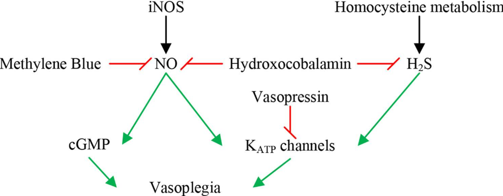
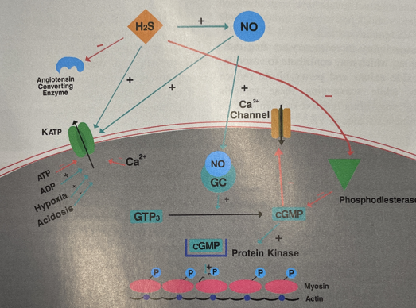
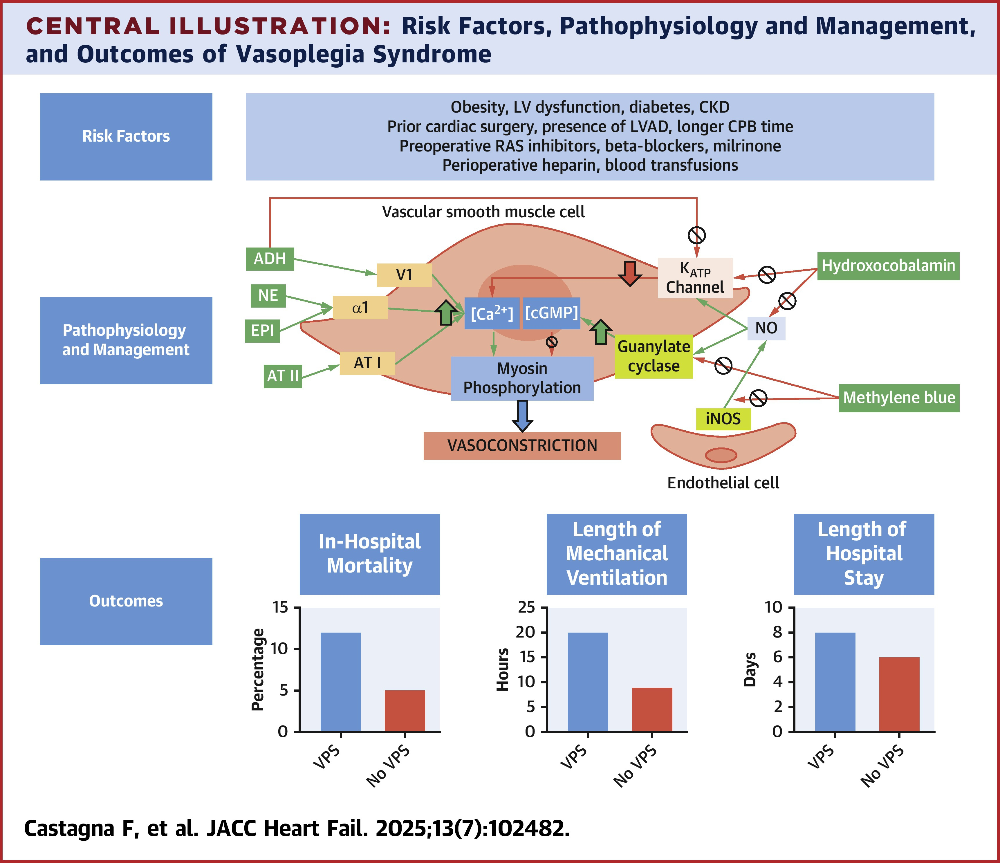

# Vasoplegia

Vasoplegia is a type fo distributive shock that follows cardiac surgery in up to 25% of cases. This leads to prolonged ICU stays, renal fialure, and increased mortality. Catecholamine resistant vasoplegia can be lethal with mortality rates approaching 25%. Vasoplegia can also exist in septic shock, end stage liver disease, and glucocorticoid deficiency.

## Risk Factors

- Preoperative ACEi
- Higher comorbid disease burden
- Low preop EF
- Vasopressor support before and/or during CPB
- Warmer core temperature on CPB
- Long cross clamp time

## Criteria

- MAP < 65 with an index of > 2.2

## Physiology Simplified

## Specific Effect of H2S and NO

## Treatment Goals

- Restore and Maintain MAP
  - Vasopressors
  - Inhibit vasodilatory mediators
    - Methylene blue vs Hydroxocobalamin
  - Goal directed fluid admin
- Improve Tissue Perfusion
  - Fluids
  - Inotropes
  - Mechanical Support
- Prevent End Organ Damage
  - Anemia treatment
  - Assess renal, respiratory and cardiac function
- Identify and Treat Causes
  - Immune suppression
    - Steroids
    - Histamine blockers
    - Ascorbic acid/Thiamine
  - Assess other factors
    - Acidosis
    - Hypovolemia
    - Cardiogenic Shock
    - Sepsis
    - Medication/Transfusion Reaction
    - Anaphylaxis
    - Adrenal/Thyroid Crisis

## Treatment Regimen

This is in order for the most part. I would recommend angiotensin II or vaso before epinephrine if the cardiac function is okay.

- Norepinephrine (0.02-0.5mcg/kg/min)
- Vasopressin (0.02-0.1un/min)
- Epinephrine (0.01-0.2mcg/kg/min)
- Angiotensin II (5-40ng/kg/min)
- Methylene Blue (1-2mg/kg bolus in 15min +/- 0.5-1mg/kg/hr infusion)
- Hydroxocobalamin (5g bolus over 15min can repeat x1)
- Hydrocortisone (50mg q6h or 100mg q8hr)
- Ascorbic acid (6g daily in divided doses per pharmacy)
- Thiamine (400 mg daily)
- Diphenhydramine (25-50mg q4-6h max 400mg in 24hr)

### Comparison Between Methylene Blue and Hydroxocobalamin

A small sample size study showed no difference between the two treatment options when faced with vasoplegia status post cardiac bypass.  

[Link to Article](https://www.jcvaonline.com/article/S1053-0770(21)00455-9/fulltext)

## Summary

