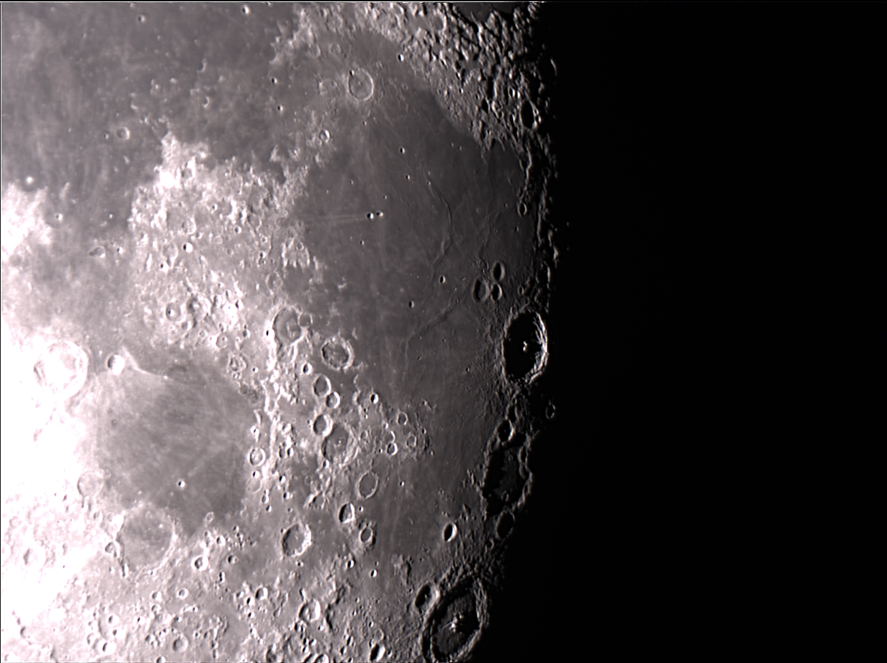

---
# the default layout is 'page'
icon: fas fa-info-circle
order: 4
---

## Thanks for visiting and welcome to my site!

I am a CRNA who works in Upstate New York. I enjoy open and closed/structural heart, and vascular anesthesia. I currently work in private practice but have spent  some time in academics both as staff and locums. When I am not at work my wife and I are frequently hiking in the northeastern mountains and are working on our Northeast 111 high peaks.  
  
{: width="600" }{: .center}
  

   

I love teaching and find it difficult to share resources during cases besides awkward emails and cellphone photos. Using some time off I merged my love of coding and anesthesia and finally found a way to simplify that process.
  
My wife is an avid photographer and if you are every in need of her services check our her website and portfolio. Check out Nicole's website and portfolio!
- 💬 Ask me about **my Nicole's photography at [NicoleZauskiPhotography.com](https://NicoleZauskiPhotography.com)**

  

{: width="400" }{: .left}  
My other hobbies include astronomy/astrophotography and you will find some posts here and there. My current set up is an 8in dobsonian with a ZWO ASI224MC color planetary camera.  
  
I enjoy computer science and coding. My focus is in python with a special interest in machine learning and AI. I enjoy applying computer science solutions to health care or astronomy problems. Most of these solutions deal with big data or little data depending on your definition. Some of my models and projects are on display here. Check out my github for more projects and detailed readmes.

- ⚡ I’m currently working on **a Jekyll Blog and python machine learning projects**

- 🌱 I’m currently learning **CS50 AI** and **CS50 SQL**

- 👨‍💻 All of my projects are available at [https://github.com/dzauski585](https://github.com/dzauski585)

- 📫 How to reach me **dzauski585@gmail.com**

<h3 align="left">Connect with me:</h3>

<h3 align="left">Languages and Tools:</h3>
             

