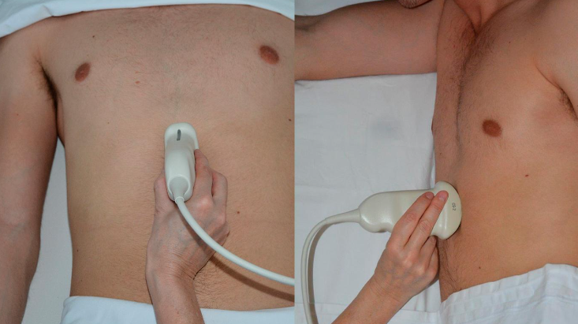
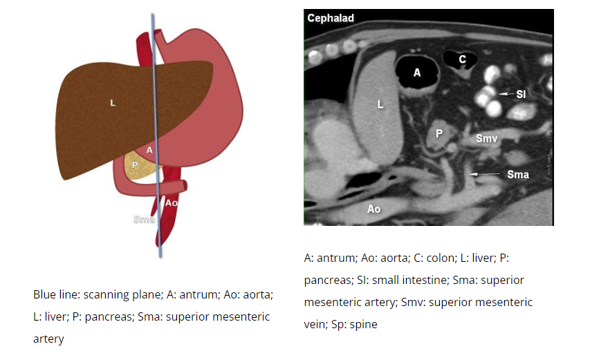
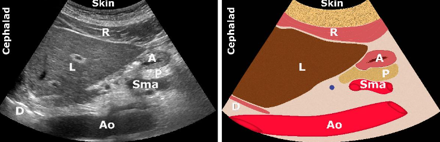
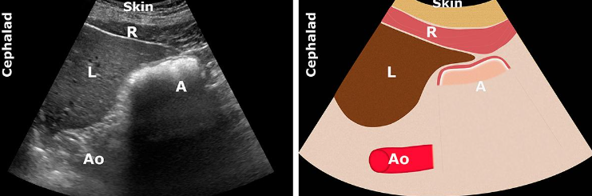
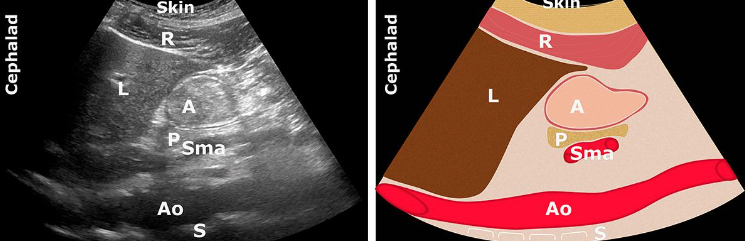
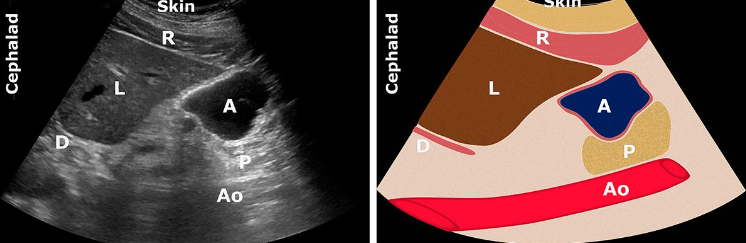
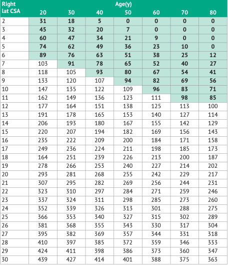

---
title: Gastric Ultrasound
tags: [anesthesia]     # TAG names should always be lowercase
---
## Scanning

- Abdominal settings with curved arrway low frequency (2-5mHz) probe
- Scan in sagittal plane
- Sweep between subcostal margins
- Start supine and follow up with right lateral decubitus

## Applied Anatomy

- Gastric antrum reflects contents of the entire stomach
- Hollow structure with a prominent wall

## Empty Stomach

## Solid Food Early Stage

## Solid Food Late Stage

## Fluids

## Volume Conversion

## Gastric Ultrasound Flowchart

[View PDF](../assets/pdf/GastricUlraSound_Flowchart2020.pdf){ .md-button }