---
title: Pharmacology Review
tags: [pharm, cardiac, locals, anticoagulants]   
---

## Alpha 2 Agonists

- Dexmedetomidine
- Clonidine
  
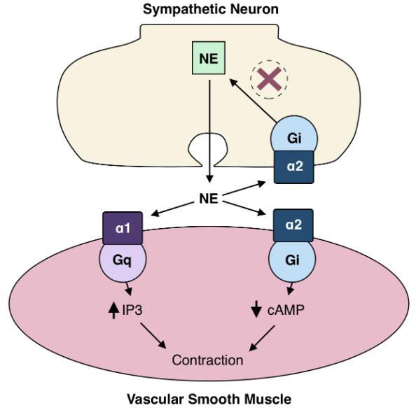

Rapid precedex administration can stimulate postsynaptic receptors causing inc BP. Over time presynaptic stimulation will overpower this peripheral response.

## Anticoagulants

See the [coagulation cascade](../boards/Anatomy_physiology.md#coagulation-cascade) in [Anatomy and Physiology](../boards/Anatomy_physiology.md)

### Dual Antiplatelet Inhibitors

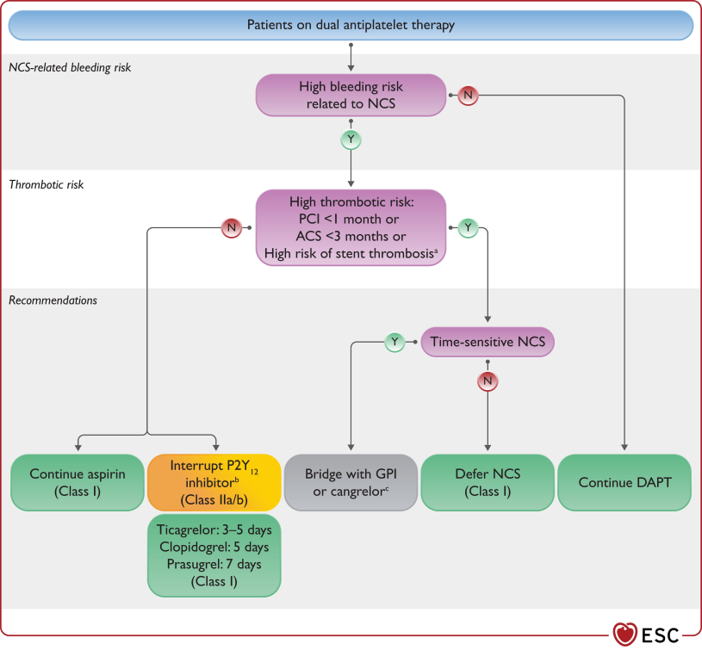

- 3-5-7 days
  - Brillinta (Ticagrelor) - Plavix (clopidogrel)-Effient (Prasugrel)

If these medications are prescribed for drug eluding stents DES, review ACC guidelines on discontinuing or postpone the case as needed. See the graphics from the 2023 ECC

### NOACS and DOACS and What to do!

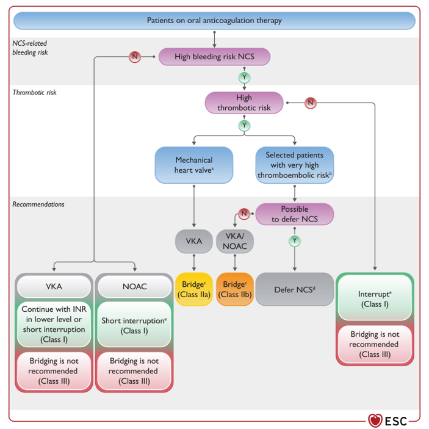

#### Holding preop?

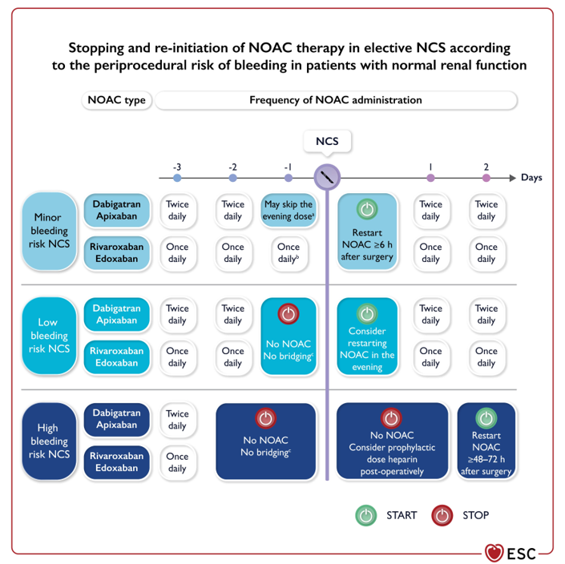

### Reversal!

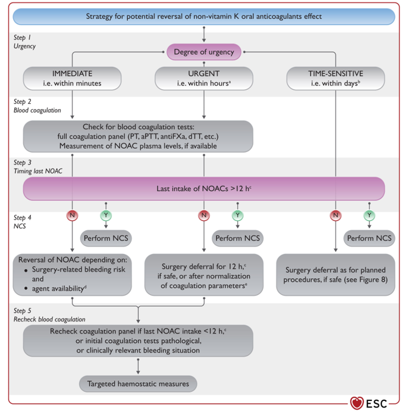
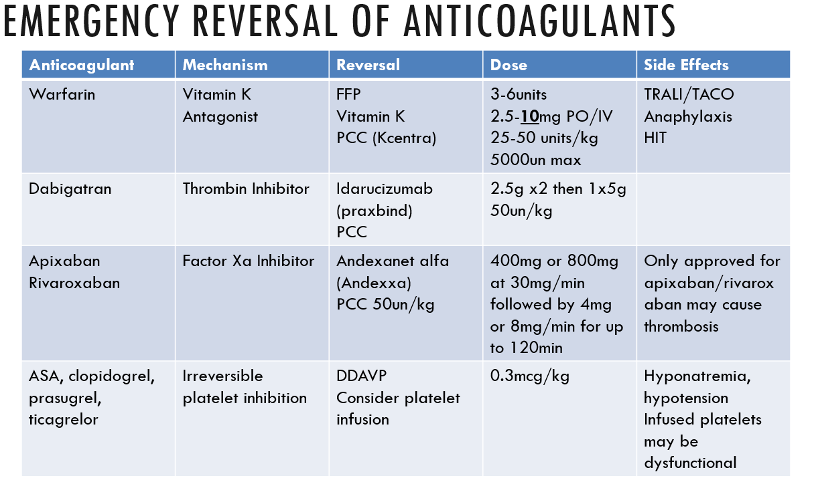

## Beta Blocker Classifications

- A-M Selective B1 
- N-Z Non Selective B1 and B2
- -olol: Pure beta
- -lol beta and alpha or potassium blocker activity (sotalol)

## Chemotherapy

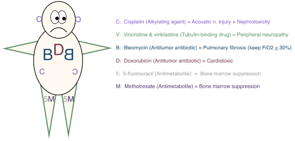

## Indocyanine Green

- Summary
  - For DaVinci by Intuitive Surgical
  - Contains sodium iodide and should be used with caution in patients who have a history of allergy to iodides or iodinated contrast
- Preparation
  - Mix ICG with 10ml sterile water to obtain 2.5mg/ml
- Administration
  - 1.25mg or 0.5ml will normally yield good images with patients wieghing less than 90kg.

!!! danger
    Total ICG dosages shoudl not exceed 2mg/kg per patient

## Local Anesthetics

### Max Dose

!!! info
    Use Safe Local App

- Chloroprocaine 12mg/kg
- Bupivacaine 3mg/kg
- Lidocaine 4.5 or 7mg/kg
- Ropiviciane 3mg/kg
- Fun math trick: 1mg lidocaine = 3.6mg ropivicaine

### Do you need to Dilute Locals?

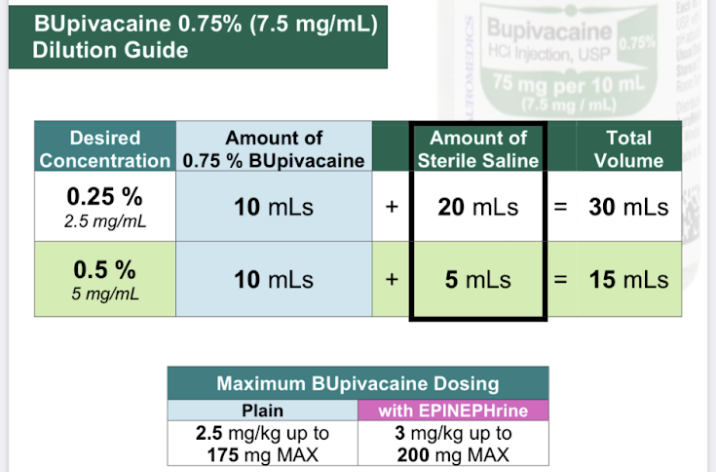

## Sugammadex Safety

!!! info
    Ok in dialysis patients but need special filter

!!! danger
    3.57mg of sugammadex binds to 1mg of Rocuronium

!!! danger
    Crystallized with zofran

!!! danger
    Binds to hormonal birth control

!!! danger
    Use atropine and neostigmine with pregnant patients due to possibility of sugammadex binding to progesterone. 0.1mg atropine per 1mg neostigmine.

## Preoperative Cessation of SGLT2i

From [American College of Cardiology](https://www.acc.org/Latest-in-Cardiology/Articles/2022/10/07/17/21/Preoperative-Cessation-of-SGLT2i#:~:text=When%20caring%20for%20patients%20being,ketoacidosis%20and%20urinary%20tract%20infections.)

!!! info
    When caring for patients being referred for surgery it is important to advise patients to stop their SGLT2-inhibitors 3-4 days prior to surgery to minimize the risk of postoperative ketoacidosis and urinary tract infections.

!!! info
    The cardiovascular teams should be aware of recent Food and Drug Administration (FDA) advisory warnings for increased incidence of euglycemic diabetic ketoacidosis when SGLT2-inhibitors medications are continued prior to non-cardiac surgeries.

!!! danger
    The FDA released multiple warnings related to the elevated risk of DKA. The recommendation is for canagliflozin, dapagliflozin, and empagliflozin to be discontinued 3 days before scheduled surgery and ertugliflozin should be stopped at least 4 days prior to surgery. This differs from other diabetic medications which are typically held the day of surgery. With the increase in SLGT2-inhibitors being prescribed for both diabetes and heart failure, it is crucial that providers are aware of this preoperative hold parameter and recognize patients at risk for EDKA.

Euglycemic diabetic ketoacidosis (EDKA) is an uncommon but life-threatening diagnosis and must be considered in postoperative patients who have been on SGLT2-inhibitors. EDKA in this setting has been reported to occur any time during the course of medication use.

It should be considered when a patient has:

- An anion gap metabolic acidosis and pH <7.3
- Elevated ketones in the blood or urine
- A blood glucose <200

Given the clinical overlap with starvation ketoacidosis, it is a difficult diagnosis to make. The mechanism of both is similar, except that in EDKA, the patient has diabetes mellitus and has been taking a SLGT2-inhibitor.

### Proposed Mechanism of EDKA

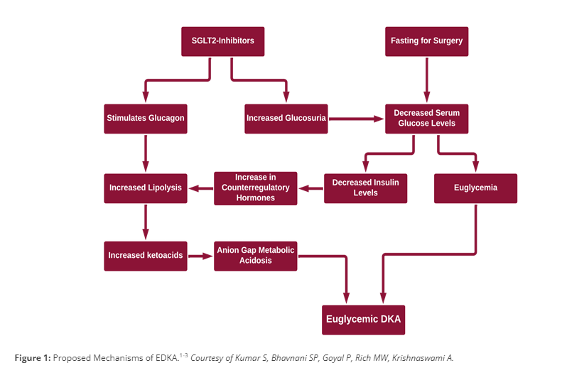

### Lab Testing

- Betahydroxybuterate -- for euglycemic DKA dx in patients taking SGLT2 Inhibitors.

## Preop Cessation of GLP1s

Position Statement by the ASA 06/29/2023

### American Society of Anesthesiologists Consensus-Based Guidance on Preoperative Management of Patients (Adults and Children) on Glucagon-Like Peptide-1 (GLP-1) Receptor Agonists

Glucagon-like peptide-1 (GLP-1) receptor agonists are approved by the Food and Drug Administration for treatment of type 2 diabetes mellitus and cardiovascular risk reduction in this cohort. In addition, GLP-1 receptor agonists are also used for weight loss. Several entities have recommended to hold these drugs either the day before or day of the procedure.For patients on weekly dosing, it is recommended to hold the dose for a week.

The GLP-1 agonists are associated with adverse gastrointestinal effects such as nausea, vomiting and delayed gastric emptying. The effects on gastric emptying are reported to be reduced with long-term use. This is most likely through rapid tachyphylaxis at the level of vagal nerve activation. Based on recent anecdotal reports, there are concerns that delayed gastric emptying from GLP-1 agonists can increase the risk of regurgitation and pulmonary aspiration of gastric contents during general anesthesia and deep sedation. The presence of adverse gastrointestinal symptoms (nausea, vomiting, dyspepsia, abdominal distension) in patients taking GLP-1 agonists are predictive of increased residual gastric contents.

The use of GLP-1 agonists in pediatrics has primarily been reported for the management of type 2 diabetes mellitus and obesity. The published literature on GLP-1 agonists in pediatrics is predominantly from pediatric patients 10-18 years old; concerns are similar to those reported in adults. During the conduct of general anesthesia/deep sedation, children on GLP-1 agonists have similar gastrointestinal adverse events at a rate similar to adults.

The American Society of Anesthesiologists (ASA) Task Force on Preoperative Fasting reviewed the available literature on GLP-1 agonists and associated gastrointestinal adverse effects, including the consequences of delayed gastric emptying. The evidence to provide guidance for preoperative management of these drugs to prevent regurgitation and pulmonary aspiration of gastric contents is sparse limited only to several case reports. Nevertheless, given the concerns of GLP-1 agonists-induced delayed gastric emptying and associated high risk of regurgitation and aspiration of gastric contents, the task force suggests the following for elective procedures. For patients requiring urgent or emergent procedures, proceed and treat the patient as ‘full stomach’ and manage accordingly.

#### For patients scheduled for elective procedures consider the following:

##### Day(s) Prior to the Procedure:

- For patients on daily dosing consider holding GLP-1 agonists on the day of the procedure/surgery. For patients on weekly dosing consider holding GLP-1 agonists a week prior to the procedure/surgery.
- This suggestion is irrespective of the indication (type 2 diabetes mellitus or weight loss), dose, or the type of procedure/surgery.
- If GLP-1 agonists prescribed for diabetes management are held for longer than the dosing schedule, consider consulting an endocrinologist for bridging the antidiabetic therapy to avoid hyperglycemia.

##### Day of the Procedure:

- If gastrointestinal (GI) symptoms such as severe nausea/vomiting/retching, abdominal bloating, or abdominal pain are present, consider delaying elective procedure, and discuss the concerns of potential risk of regurgitation and pulmonary aspiration of gastric contents with the proceduralist/surgeon and the patient.
- If the patient has no GI symptoms, and the GLP-1 agonists have been held as advised, proceed as usual.
- If the patient has no GI symptoms, but the GLP-1 agonists were not held as advised, proceed with ‘full stomach’ precautions or consider evaluating gastric volume by ultrasound, if possible and if proficient with the technique. If the stomach is empty, proceed as usual. If the stomach is full or if gastric ultrasound inconclusive or not possible, consider delaying the procedure or treat the patient as ‘full stomach’ and manage accordingly. Discuss the concerns of potential risk of regurgitation and pulmonary aspiration of gastric contents with the proceduralist/surgeon and the patient.
- There is no evidence to suggest the optimal duration of fasting for patients on GLP-1 agonists. Therefore, until we have adequate evidence, we suggest following the current ASA fasting guidelines.

Refer to the [Gastric Ultrasound Page](../boards/gastric_US.md)

## Subcutaneous vs IV

- If emergency surgery use IV insulin drip
- If elective surgery AND:
  - Case is < 4 hours
  - Patient is not critically ill
  - Patient does not have poor glucose management
  - There is no expected fluid instability/shifts
  
  Use subcutaneous insulin

## Dosing: Refer to current practice facility

Here is a sample dosing chart
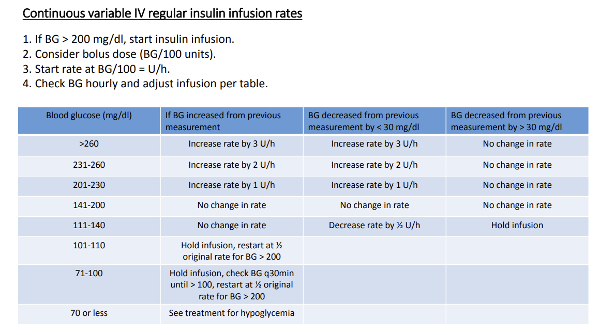
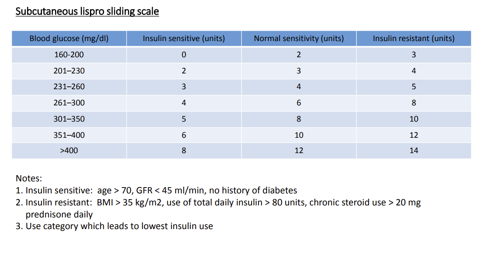

## Hypoglycemia Treatment

1. If BG < 70 stop insulin treatment
2. Administer 25cc of D50 or start D10 infusion
3. If BG < 50 administer 50cc of D50
4. Check q15min until BG > 70