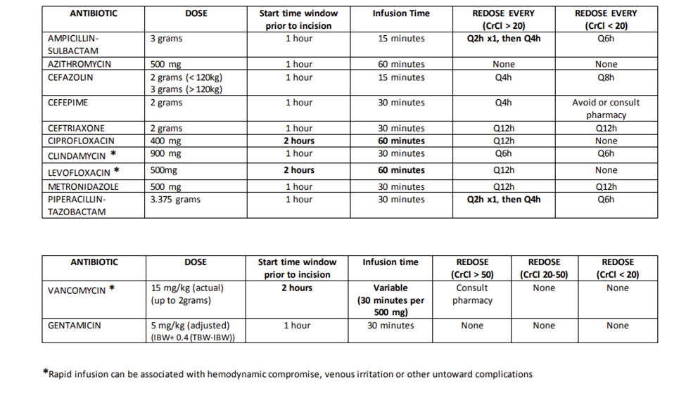

---
title: Perioperative Antibiotic Protocol 
tags: [anesthesia, antibiotics]     # TAG names should always be lowercase
---

## Perioperative Antibiotics Protocol

For further reading this guide below is from Stanford and was last updated in 2019. Refer to local institutional guidelines whenever possible.

[Open PDF in new tab](../assets/pdf/SHC-Surgical-Prophylaxis-ABX-Guideline.pdf){ .md-button }
