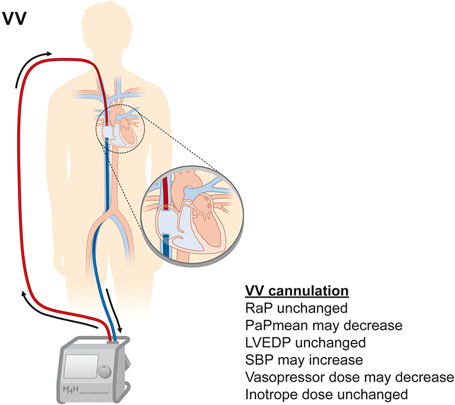
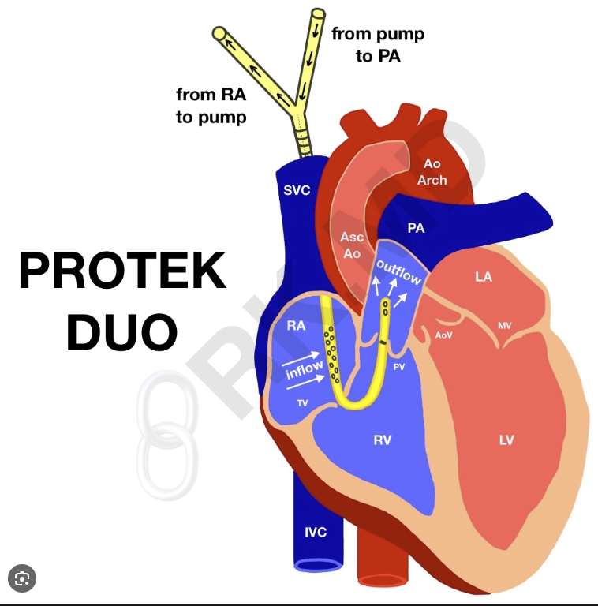
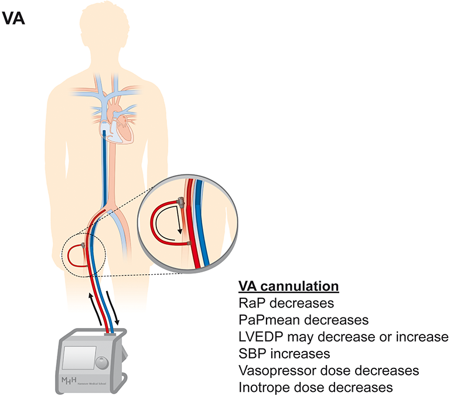
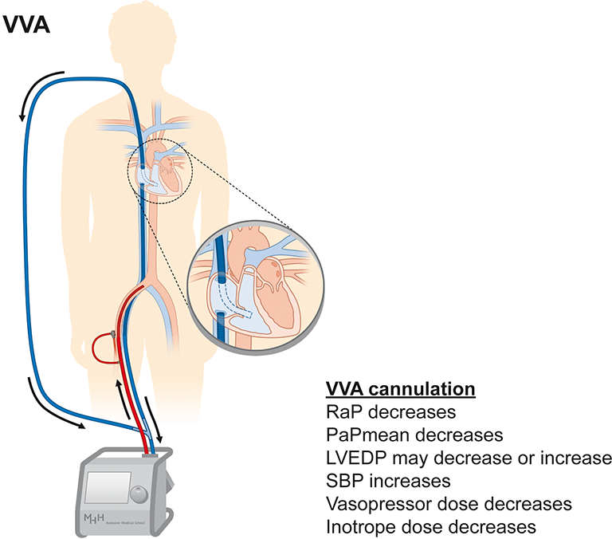
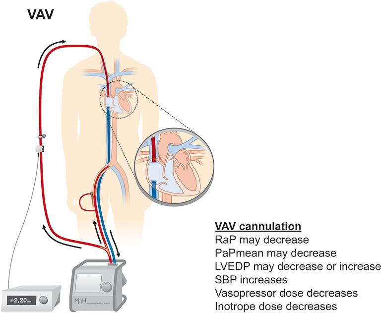

---
title: Mechanical Support
tags: [anesthesia, cardiac surgery, cardiac anesthesia, ECMO]     # TAG names should always be lowercase
---
## ECMO Circuit Review

### VV ECMO

Most common for lung issues such as ARDS

#### Protec Duo Cannula

This special VV ecmo is used when a patient is in isolated RV failure with oxygenation needs.

### VA ECMO

Heart failure, cardiogenic shock, PE. Need to worry about North South syndrome. North being deoxygenated, and South being oxygenated. Also may lead to LV distension in poor outflow states consider VAV or impella or both.

### VVA ECMO

VA ecmo with increased drainage may help offload LV distension

### VAV ECMO

Combined VV and VA support. May need impella for LV distension

## Impella Devices

[J&J Med Tech formerly Abiomed Product Information](https://www.heartrecovery.com/en-us/products-and-services/impella?gad_campaignid=12344260700&gad_source=1&gbraid=0AAAAADnMLvaEHFRzEHzpHIBfYnQQI-3Lt&gclid=CjwKCAjw5NvPBhAoEiwA_2egfhg52nMSs7t7STZqa8LywtfbJfYYfz1GLGLYCkuGNk3e6Dhh8x-L6RoCip0QAvD_BwE&hsa_acc=5805226965&hsa_ad=734873863166&hsa_cam=12344260700&hsa_grp=180798605692&hsa_kw=impella%20heart%20pump&hsa_mt=b&hsa_net=adwords&hsa_src=g&hsa_tgt=kwd-317279600791&hsa_ver=3&utm_campaign=Web%202.0%20Branded%20-%20Clinical&utm_medium=ppc&utm_source=adwords&utm_term=impella%20heart%20pump)

### Device Overview

| Device | Access | Max Flow | Common Use |
|--------|--------|----------|------------|
| CP | Percutaneous | 3.7 L/min | Most common from cath lab|
| 5.5 | Surgical cutdown | 5.5 L/min | Longest duration (Can Ambulate)|
| RP Flex | IJ or Femoral Vein | 4 L/min | Full RV Unloading (Can Ambulate)

### TEE Positioning Verification

- Inlet (pigtail) in LV pointing toward apex
- Outlet in ascending aorta above aortic valve
- Straddling the aortic valve = malposition — reposition
- RP FLex should be beyond pulmonic valve with PA tracing

### Aortic Insufficiency Complication

- Device crosses aortic valve — can worsen or unmask AI
- Signs: reduced flow despite good position, rising PCWP
- Large patients may exceed max flow capacity with significant AI

### Suction Events

- Inlet against LV wall or septum
- Console alarm + sudden flow drop
- Fix: reduce speed briefly, give volume, reposition under TEE

### Anticoagulation

- Purge solution: heparinized dextrose through device continuously
- Systemic heparin: target ACT 160-180 (lower than CPB)
- Do NOT use protamine if planning continued Impella support

!!! danger
    Do NOT treat Impella-induced PVCs — they are mechanical.
    Do NOT reflexively volume load — Impella is already unloading LV.
    DO maintain MAP >65 — coronary perfusion depends on it.

## ECMO with LV Impella ie ECPELLA

From the pdf:  

VENOARTERIAL EXTRACORPOREAL MEMBRANE
OXYGENATION (VA-ECMO) commonly is used to support
patients with refractory cardiac arrest or cardiogenic shock
mainly via percutaneous cannulation.4 This strategy may cause
left ventricle (LV) distention that compromises myocardial
recovery. Direct LV unloading provided by Impella was associated
with lower mortality in patients with cardiogenic shock
supported with VA-ECMO in a recent international multicenter
study. The present paper has a specific purpose to provide a complete
overview of this strategy, starting from a solid pathophysiologic
approach. Then, the rationale for unloading the LV and the
related available techniques is discussed. Finally, the combined
configuration of VA-ECMO and Impella (ECPella) is fully
treated, providing its significant clinical applications.

[View PDF](../assets/pdf/ECPella--Concept,-Physiology-and-Clinical-Applicat.pdf){ .md-button }

## IABP Intra Aortic Balloon Pump

**Mechanism:** Diastolic augmentation (inflates in diastole to increase
coronary perfusion), systolic unloading (deflates before systole to
reduce afterload).

**Timing modes:**
- ECG trigger — standard, uses R wave to time inflation
- Pressure trigger — backup when ECG signal is poor

**Weaning:** 1:1 → 1:2 → 1:3 as patient stabilizes

**Contraindications:** Significant AR (worsens regurgitation),
aortic dissection, severe peripheral vascular disease

**Console:** Watch augmentation waveform shape, trigger mode indicator,
helium volume alarm

**Removal:** Surgeon removes while anesthesia manages