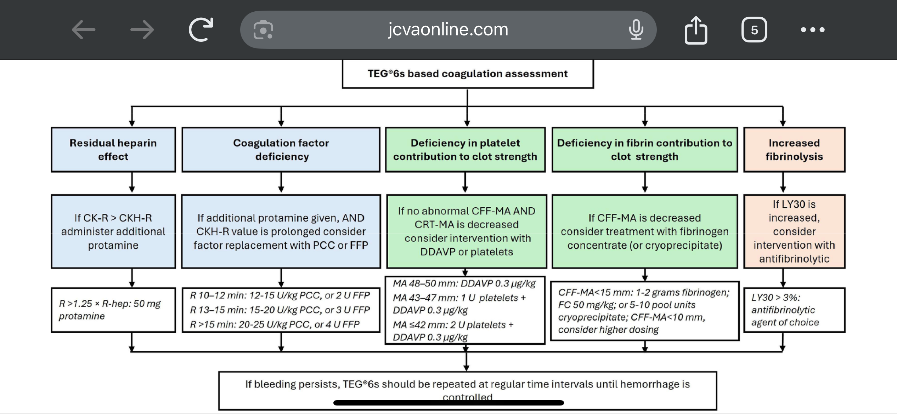

---
title: All About TEG
tags: [emergency, bleeding, teg]     # TAG names should always be lowercase
---
## Thromboelastogram TEG Summary

TEG6 algorithm proposed by Syracuse anesthesiologist Dr. Courtney Maxey-Jones. See the paper here: [Link to paper](https://www.jcvaonline.com/article/S1053-0770(25)00122-3/fulltext)

Courtesy of [ICU One Pager!](https://onepagericu.com/) Another TEG algorithm.

[View PDF](../assets/pdf/ICU_one_pager+-+TEG+v12.pdf){ .md-button }