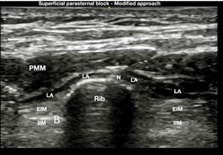
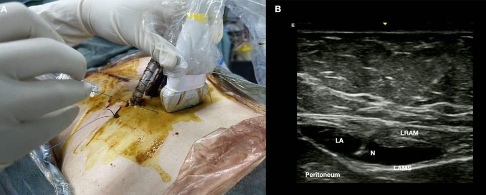
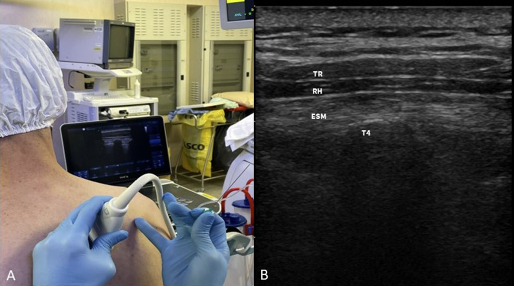
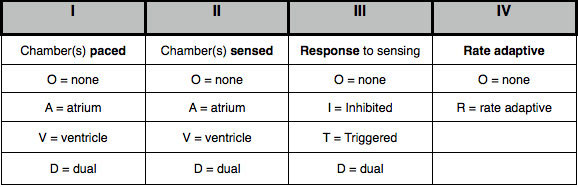
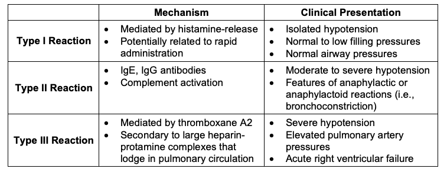

---
title: Cardiac Anesthesia CVOR Guide
tags: [anesthesia, cardiac anesthesia, cardiac surgery ]     # TAG names should always be lowercase
---

## Resources

- Great book resource [Hensley's Practical Approach to Cardiothoracic Anesthesia](https://www.amazon.com/Hensleys-Practical-Approach-Cardiothoracic-Anesthesia/dp/1496372662/ref=asc_df_1496372662/?tag=hyprod-20&linkCode=df0&hvadid=312168414377&hvpos=&hvnetw=g&hvrand=3323556718819415157&hvpone=&hvptwo=&hvqmt=&hvdev=c&hvdvcmdl=&hvlocint=&hvlocphy=9002411&hvtargid=pla-524262916019&psc=1&mcid=d481058e88cd3c099fda1ff353ae0117)
- [Cardiac Physiology](cardiac_physiology.md)
- [CV Pharmacology](CVPharm.md)
- [TEE Basics and Advanced](TEE.md#exam-overview)
- [Heart Valve Physiology and Anesthesia](cardiac_physiology.md#valve-pathophysiology)

## Morning Setup

- Normal machine check, size 8 ett for women and 8.5 for men especially if bronchial blocker is used
- OGT, pacemaker box on top of the pyxis, check for calcium, magnesium, potassium, milrinone, and at least two albumin available in the bottom drawer.  
- Arterial line set up on rolling table lido in insulin/TB syringe for pre-induction line and whatever flavor of arterial catheter you like. Do not forget ultrasound jelly.
  - The anesthesia techs should have this mostly set up for you. They will set up the swan, cables, eye tegaderms, transcranial oximetry if needed, bronchoscope, etc.
- Make sure you tell the tech your glove and gown size for the central line.
  - They will prepare your tray and have your equipment on top.
- If using a bronchial blocker open the box and lubricate it and also open up the ETT adapter. Ensure there is a fiberoptic scope in the room to confirm placement

### Cardiac Tower (all drips programmed but on standby)

- Amicar 1g/hr (except off pump CABG)
- Norepinephrine 0.04 mcg/kg/min
- Propofol 100mg vial, dosing is age and situation dependent around 30mcg/kg/min
- Precdex dosing is age and situation dependent around 0.3 mcg/kg/min
- Insulin 2-4un/hr ONLY IF blood sugar is greater than 150 preop
- Nicardipine Have in ther room not spiked for isolated CABG, AVR, and patients less than 70. Dosing 5mg/hr then titrate.
- Milrinone for mitral, tricuspid, and multiple combination surgery 0.25mcg/kg/hr
- Epi in the room for low ef, sick, multiple combination surgery (check with preceptor before preparing) 0.02mcg/kg/min

### Syringes

- Midazolam, 5-10mg
- Fentanyl, 250-500mcg
- Propofol, 200mg
- Rocuronium 100mg
- Cefazolin 2-3g
- Epinephrine, 10mcg/mL in 10cc (mix 1mg in 100cc bag)
- Norepinephrine, 16mcg/mL in 10cc (draw 5cc out of norepi bag and add 5cc saline to syringe)
- Nitroglycerin draw up vial without dilution for Dr. Velez. Others draw up 1cc and add 9cc of saline to make 40mcg/cc
- Ketamine case dependent. Not for bicuspid AV, MS, dissection
- 2-4g of magnesium bags ready for infusion after induction

## Hemodynamic Goals

- CABG: Keep BP, HR normal within reason do not go low so as to avoid ischemia
  - People rarely die of hypertension, but many die of low-pertension
- [Valve hemodynamic goals](cardiac_physiology.md#valve-pathophysiology)

## Case Flow

### Pre-Induction/Induction/Lines

- If the case calls for a heartport (minimally invasive thoracotomy) You may be placing a ESP block immediately upon entering the room.
- We always do a pre-induction arterial line and we start on the right side. The right side because this is the same side of the monitoring equipment in the OR and the ICU, and there is less pulling on the lines when you transfer. Clinically, the right radial gives the best estimate of right-sided cerebral perfusion pressures. This is especially important when the femoral artery is used for arterial cannulation and when a dissection case requires a distal aortic cross clamp.
  
??? info "Click for Help with Ultrasound Arterial Line Insertion"
    - [Ultrasound Arterial Line Youtube](https://www.youtube.com/watch?v=UQpouFxoxa8)
    - [Arrow Catheter Arterial Line](https://www.youtube.com/watch?v=VtoVavr0W9k)
    - [New to ultrasound lines?](../cvor/ultrasound.md)

- Next will be induction and intubation.

??? info "Click for Induction Tips"
    - It is very rare to give the high dose opioids and versed for induction. Most will induce the patient like it’s a sick hip fracture; A little versed (2-5mg), a little fentanyl (50-100mcg), touch of propofol and topped off with some zemuron. Ketamine is also frequently part of the induction 25-50mg.
    - The use of high versed and opioids harkens to a time when anesthetic agents were not available on the bypass machines. High opioids were thought to provide the most stable of anesthetics, with blood pressure swings being minimal, the “stress” response minimized. The use of high dose benzo’s were for amnesia. Present day every patient coming for surgery are on beta-blockers; the stress response to induction is minimized. In addition, lets be practical in our thought process, most patients who come for elective coronary surgery had a stress test at some point and did not die during that process. In addition our goal in anesthesia is maintain normal hemodynamics. When you induce the sick old hip fracture patient or do a BiV pacer/AICD, would ever consider giving 20 ml of Fentanyl and 10mg of versed for a “stable” induction? Not in a million years. So why do that for cardiac patient? If they have a normal blood pressure of 120-140 , maintaining that during our induction should be fine. 
    - In the setting of a high opioid induction when there is no surgical stimulation for about an hour after induction, you will find yourself having to support low blood pressure while trying to focus on placing lines and obtaining TEE images.  High normal BP is better than low BP for coronary, cerebral and renal perfusion, especially in the setting of Aortic Stenosis, mitral Stenosis and tight Left Main coronary disease. As a clinician new to cardiac anesthesia it might not seem bad when you have an attending able to push your phenylephrine when you are scrubbed doing lines, but when you are all alone, it can a daunting task. You may notice I am more concerned about the dose of opioid than versed for induction. It tends to be the opioids that cause the greatest drop in BP especially when given with propofol. However, it should be noted that the versed dose, especially in the elderly, can have the biggest impact in post-op extubation times
    - Sternotomy = Single lumen tube 7.5 or 8.0. Some like the 8.5 ETT when using a Blocker, however this is not required for placement. The ICU team greatly appreciates at least a 7.5 ETT , please do not force a large ETT in a tiny old lady and leave the ICU with no cuff leak. TEE in of themselves can increase dysphagia by up to 4%, adding a large ETT actually promotes swallowing difficulty postop as well.

- Then the neck will be prepped usually on the right side (both sides prepped just in case) and the patient will be placed in a slight T-berg. 
- You will use the avoguard hand wash in the room to “scrub”.
- Then you will get your gown and gloves on for the central line.

??? info "Click if new to Central Line Placement"
    - Talk through what you are doing and this will instill confidence in others you do know what you are doing. ‘I see IJ lateral to the carotid, the IJ is collapsible when I press down with the probe, I am going down with my needle at a steep angle towards the ipsilateral nipple as I aspirate’ etc etc. Once the attendings get to know you, they won’t hover as much, they just want to be confident you know what you are doing… and you do! At the beginning, silence and performing incorrect actions is more scary than narrating exactly what you are doing. Make sure you can see your needle tip as you are entering the IJ.
    - A major key to success in any central line placement is to never, ever lose sight of your wire. You don’t need to bury or hub your wire or needle, and you’ll likely see ectopy if you do. Once you thread the introducer over the central line, make sure you see the wire popping out the back before you begin to push in the dilator.
    - [IJ Cordis and Swan Insertion](https://www.youtube.com/watch?v=5TbRGZ2-YNs)
    - It would be highly suggested to practice suturing at home before you come into the CVOR. No one is expecting you to be perfect, but others may be tempted to take over the line procedure if you are fumbling with suturing. Use an orange, watch youtube videos, and practice with a needle driver on how to suture. This skill should not be overlooked.
  
- You will take the swan from your anesthesia tech still sterile, and place the swan cover ~80cm and lock the distal end in place. (Little hole to the little swan)
- When inserting the swan, there is no reason to look down at the swan after you hit 20cm (and say ‘balloon up’), this is the time where you look at the monitor and watch the waveform change.
- Remember when putting on your swan cover proximal to the patient there are two locks, one to lock the cover to the introducer and one lock to lock the swan in place so it doesn’t move inside the cover.
- [Review of CVP and Swan catheters](cardiac_physiology.md#pa-catheter)
- Next will be TEE insertion.
- And finally a bronchial blocker if lung isolation is needed.
- [EZ Blocker insertion](https://www.youtube.com/watch?v=HM12Zcu-DQ8)

- If the case is a sternotomy then the last steps are to help with the monster and shoulder role. The monster is a large metal tray to help protect the patient’s head and allow for supplies storage during the case.

## Cardiac Aneshesia Nerve Blocks

See the PDF regarding the blocks as it covers all of the blocks that we do!

[View PDF](../assets/pdf/cardiac_surgery_blocks.pdf){ .md-button }

### Setup

- Draw up 2-3 30cc syringes with 0.25% ropi. This is done by mixing 15cc of 0.5% ropi with 15cc of saline. P
- Prepare a set of sterile gloves, prep stick, ultrasound cover/gel, and a needle(2-3.5in based on pt)

### Parasternal Intercostal Fascial Plane Block (PIFB)

T4 is approximately the nipple line so start there and aim for spreading above and below this level

### Rectus Sheath Block

For sternotomy
Chest tube pain is often referred and difficult to treat so I do not use this block as much but you can do it.

### ESP Block

For thoracotomy

T4 is approximately the ridge of the scupla and T6 is the tip of the scapula. Aim for T4.

### Serratus Anterior BL

For thoracotomy if pt cannot sit or in addition to ESP if you dose correctly
Good landmarks are midaxillary line at the level of the 4th or 5th rib or the nipple, and slightly tilt the probe toward the head. If you cannot see the latissimus dorsi then you are too anterior.

## Final Preincision Steps

- Start the amicar drip at 1g/hr and then add a bolus of 5g over 30min
- Start the sedation drips
- Consider tiding up the area
- Make sure you give antibiotics
  - Ancef is primary
  - Vanco additional if MRSA positive
- Ensure the patient has had a beta blocker in the last 24 hours. If not give some esmolol or metoprolol depending on hemodynamics.

## Off Pump CABG

- Fluids and pressers are main treatment modality as the heart gets manipulated
- Do not give albumin until the IMA are done being taken down...otherwise you have expensive urine and no real help to your preload/CO
- May need higher doses of pressers  and pushes during the times when the heart is being manipulated or held in an abnormal position. Look in the chest!
- Usually do not need amicar. Ok to ask the surgeon.

## Minimally Invasive Surgery

### Robotic CABG

- On vs off pump or pump assist
- Bronchial blocker after central line
- Amicar not  needed if not going on bypass
- Groin cannulation if on pump
- Left thorocotomy
- ESP block before arterial line either sitting on OR table or stretcher

### Robotic Mitral, Isolated mitral/aortic/tricuspid valve repair/replacement, Dr. Zhou ascending aorta replacement

- Right thorocotomy
- ESP block before arterial line
- Bronchial blocker after central line
- Groin cannulation

## Redo Cases

- Redo sternotomy take note of the heart position on CT scan. May need to cannulate and cool before incision.
- Redo mitral may be unable to clamp. Consider Vfib for cardioprotection with fibrillation box

## Aortic Dissection and Ascending Aorta Replacements with and without Circulatory Arrest with Deep Hypothermia

- DHCA for aortic dissections or certain situations when the aorta cannot be clamped.
- Bilateral Aline especially left if right brachiocephalic artery getting worked on
- Consider Femoral Aline
- Consider glide scope for intubation to be less stimulating
- Prior to Circ Arrest: 5 Versed, 100 Roc, 200 Prop or 10 Versed and 100 Roc
- Stop All infusions
- Cherney only one who does antegrade perfusion catheter
- Femoral Arterial cannulation
- 20C for temp then slowly rewarm
- Get blood products in the room

## Extra Surgical procedures

### Posterior Pericardiectomy/otomy

- See this [website](https://www.acc.org/Latest-in-Cardiology/Articles/2022/04/11/15/08/The-Role-of-the-Posterior-Left-Pericardiotomy-in-Reducing-Pericardial-Effusion) for a great write up on why our surgeons commonly perform this procedure. 
- The origial purpose was to decrease afib but we have found that it doesn't help as much as we thought. It does help reduce posterior effusions, and tamponade.

### Left Atrial Appendage Clip

- Medtronic clipping device that should stop flow to the LAA
- Ensure no clot in LAA before clip
- Measure stump residual after clip to ensure good clipping and to prove where it was since some clips have migrated
  
## Pre CPB Time CABG and other pump cases

- Be mindful of your IV fluids and limit these as much as possible. Perfusion does do retrograde autologous priming, but we need to preserve the Hct as much as possible. Before pump it would be ideal to have less than a liter in, so be mindful when you are pushing drugs and leaving drip lines open.

- Some of the surgeons will ask anesthesia ‘OK to start?’, so before this time you should be prepared for the high blood pressure that will come with incision. Some of the surgeons don’t say anything at all and just make an incision. The 3 most stimulating portions of the procedure: incision, sternotomy, and cutting through the pericardium. You want to get ahead of this response before they make incision- many of us give fentanyl prior to incision as we are finishing draping and turn up the gas. You also have propofol and nitroglycerin at your disposal. But do not let the pressure hit 190 as the case starts, be vigilant and prepared for the next steps of the case.
- This is the time to do a TEE exam [Intro and Advanced TEE](TEE.md)

- With a CABG, you will have some ‘down time’ between sternotomy and going on pump as they harvest the saphenous vein and/or IMA. When taking down the LIMA/RIMA watch your tidal volumes and peep and the surgeon will typically ask or make you keep bringing the lungs down.

- Prior to cannulation the surgeon will ask for Heparin, which comes from perfusion, and you’ll draw an ACT 3 minutes after. Goal ACT 400. Watch your pressure after heparin due to its histamine release.

- In order of cannulation: they will first cannulate the aorta, then insert their venous cannula(s), next is the antegrade cardioplegia cannula, retrograde cardioplegia cannula if they are using it, and then finally the LV vent.

- During aortic cannulation the pressure needs to be less than 100 systolic.

- After this cannula is tied down it is good practice to raise the blood pressure back to 120 systolic to prepare for the RAP. RAP is retrograde autologous prime or backward flow out of the arterial cannula into the CPB machine with the patients own blood for repriming. This gets rid of most of the CPB machine saline prime to avoid dropping the hct when initiating bypass. This equates to a volume loss of a 300-500cc. There is a small venous cannula RAP as well.

- If they are cannulating the groin the blood pressures do not matter as much but they should still be in the target range to avoid any arterial injuries. With groin cannulation we are responsible for guiding their wires across the IVC/SVC and descending aorta with the TEE.

## On CPB

!!! danger
    DO NOT STOP VENTILATION UNTIL PERFUSION HAS ANNOUNCED FULL FLOW.

!!! danger
    If there is pulsatility on the arterial line you are responsible for ventilation/oxygenation. There are multiple reports of anoxic brain injury due to lack of vigilance and communication.
  
- Turn the ventilator off/standby, turn off vaporizer, turn FGF down to 0.1LPM
- Ensure perfusion has turned on their isoflurane vaporizer. Communicate with the patient's anesthetic requirements.
- Paralytics: Redosing is preference but it is accepted practice to redose at the beginning of bypass and/or upon rewarming/or when the aortic clamp comes off. DON’T give prior to transport or at the end of the case, will only serve to prolong the extubations.
- Electrolytes/Labs: Keep the glucose under 180. Insulin drips and boluses are your friend. Keep an eye on acid base status and potassium/calcium. Perfusion will be adjusting their setup for titration but we can offer assistance as needed.
- Monitor urine output. It is good practice to know the prebypass, bypass, and post bypass urine amounts. If output is low while on bypass, let perfusion know (goal ~1mL/kg/hr on pump).
- Pressers: Perfusion generally manages vasopressor requirements but we can turn on drips if needed such as norepinephrine etc. When transitioning to bypass ensure that perfusion is aware of current vasoactive drips. There will be a discussion about which ones to continue and how much. Titration may be required so keep the lines of communication open.
- Rewarming: Anesthetic requirements increase with temperature. This is the second most likely time for awareness after sternotomy. Ensure patients have adequate depth! Try not to give versed at this point due to post operative/ICU delerium especially in the elderly.

### Plan for separation of bypass

- Use this time to plan the separation process in terms of drips/support
- Consider the length of cross clamp, how the surgery is going, and any added procedures
- You should, based on pre CPB parameters such as LV fxn, RV FXN, Pulm HTN, and how much phenylephrine was used by perfusion, be able to predict what might be needed

#### Pressors

- Norepi first line
- Milrinone second line
- Epi if inotrope needed
- Vaso if no inotrope needed

#### RV Dysfunction and Pulm HTN

- Milrinone- I like to mini-load with 25mcg/kg once the clamp comes off. I give to perfusion to titrate in. Most attendings don’t load but rather start it early and give it time to build.
  - 25mcg/kg max of 2mg
  - Downside to this is hypotension on bypass and remember the heart is not getting any of the medication anyway with the cross clamp on
- EPI Good inotropic support but can increase PA Pressures and systemic pressures
- Dobutamine not a preferred agent here. Reserved for Brady sinus rhythms with need for Inotropic support.
- Dopamine- rarely ever use
- Consider [RP Flex Impella](Mechanical_Support.md#impella-devices)
- Consider [ECMO](Mechanical_Support.md#ecmo-circuit-review)

#### LV Dysfunction

- Milrinone
- EPI
- [IABP](Mechanical_Support.md#iabp-intra-aortic-balloon-pump)
- [5.5 impella](Mechanical_Support.md#impella-devices)
- Consider [ECMO](Mechanical_Support.md#ecmo-circuit-review)

## Discontinue Cardiac Bypass

### WARM acronym

- Assess what was done during the surgery ie. look at the surgical valve or look at the ventricular function for an isolated CABG.
- Warm 36
- Anesthesia
- Adjunct meds
- Air
- Rate
- Rhythm
- Respiratory
- Metabolic/Monitors
  - K
  - Ca
  - Glucose

!!! info
    It is common that there is VF/VT requiring defibrillation prior to separation. The zoll should be hooked up and ready. If using the internal paddles charge to 10j. If using the normal chest pads 200j is standard. Ensure everyone is clear of the patient before shocking.

!!! info
    Optimizing the patient before separation is good practice. Usually the first separation is the best separation.

#### Pacemaker Settings Review

#### Defib Settings

- 20j for internal paddles
- 200-360j for external pads
- Synchronize for cardioversion
  - Hold the shock button so the shock will be delivered correctly

## Post Bypass

- Once separated, switch the monitor back to cardiac mode, and turn on CO monitoring.
- Low MAP and Low CVP give volume. Often cell saver and albumin. 
- Low MAP with high CVP give inotropes.
- High MAP and low CI start nicardipine.
- Volume is usually the toughest call to make. Look at the heart. Is it bulging and has no wrinkles? Volume is probably not needed. Does it look normal and snappy? Might need some inotropes.

!!! danger
    It is not appropriate to just give bolus after bolus of neo/norepi until you drop off in the unit. Use drips, volume, and a plan to guide your thinking.

!!! info
    The goal blood pressure is usually 90-110 systolic.

!!! info
    Be prepared in some situations to give lots of products such as FFP, cryo, platelets, Kcentra, DDAVP, and of course PRBCs. It is important to recall the order and ratios of transfusion especially when giving large amounts.

### Vasoplegia Following Cardiac Surgery

[Vasoplegia Overview](vasoplegia.md)

### Protamine

Large dose in a relatively short time frame. Consider using calcium and/or vaso to help with protamine hemodynamic shifts/protamine reaction. Once the protamine is in, wait five minutes and draw abg/act  and coags.

??? "Click for more Protamine Info"
    - Inactivates heparin via a heparin:protamine complex.
    - Decreases thrombin
    - Decrease in factor V, VIII activation via thrombin/Xa and tissue factor respectively
    - Decrease in factor VIII activity
    - Increased fibrinolysis
    - Decreased platelet function via increased activation, decreased thrombin, and decreased GPIb-vwF activity
    - Anticoagulant effects are mitigated by administering the correct dose of protamine and not "overdosing"
    - [Protamine rate of reactions article](../assets/pdf/Protamine_Administration.pdf){ .md-button }

## Bleeding Post CPB

- Extra protamine
- DDAVP
- Calcium
- Kcentra
- Blood products: platlets, cryo, FFP
- Factor 7
- Surgical Bleeding
- [Pericardial Baffle for aortotomy incision lines](../assets/pdf/use-of-pericardial-baffle-in-the-management-of-intractable-bleeding-in-patients-undergoing-aortic-surgery.pdf)
- [TEG if you have it](TEG.md)

## Returning to Bypass

  **Indications:** Refractory hypotension, uncontrolled bleeding, low CO

  **If protamine already given:**
    Re-heparinize 400 U/kg, check ACT before bypass resumes

!!! Danger
    Do not let the surgeon remove the aortic cannula if the patient is unstable Communicate before they pull it.

## Chest Closure and Transport

- After the chest closes CVP should rise so be mindful of additional volume if CVP is already 15.
- Lungs down so the sternum does not trap the lungs between it. Usually no PEEP during chest closure.
- Once the sternum is closed the level of stimulation drops off and so does the blood pressure.
- If the patient is stable, begin preparing for transport. Cleaning up your lines, disconnecting cables etc. Wait for vital signs cables until the final second before moving over. TEE probe can come out and an OGT can go in. When moving to the bed the patient can become unstable due to hemodynamic shifts and air bubble movement. Watch the monitor and know where your push line is. Have pressers ready.
- Make sure you have enough oxygen to get the unit. Be judicious in ventilation. Be mindful of all wires and cables. This will be the time the pacer wires are pulled out or you lose an arterial line. Get to the ICU safely and assist with hook up as needed. - Have a sign out report ready for the team.
- PLUG IN THE BED ONCE IN ICU

## Before Leaving the Room

!!! warning
    - Do not leave until everyone is satisfied and the patient is stable.
    - It is not appropriate to leave with a low CVP and high dose pressers: give volume
    - Treat electrolye abnormalities
    - It is okay to stay in the room to bring a stable patient to ICU rather than leaving too soon.
