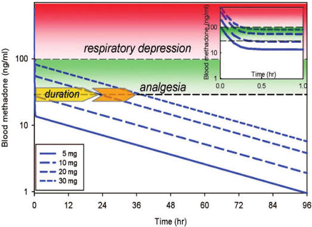
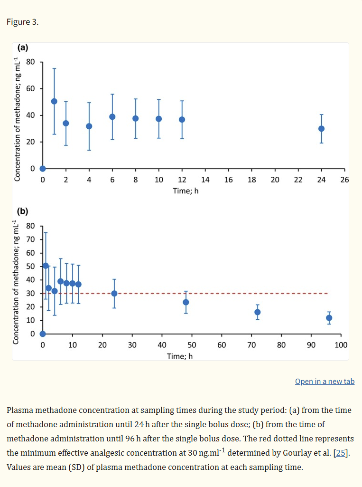

# IV Methadone Use in Cardiac Surgery

## Tips

- Order the methadone crna or md once the pt is in preop NOT when they are still on the floor or ICU if admitted.
  - There is a special tag attached to iv methadone that if ordered when the patient is not in the perioperative area it will go to order jail and need a pharmacist to physically undo it
- Located in central pacu pyxis
- Dosing rounded to nearest multiple of 5mg
- Bring a syringe and needle, alcohol and labels provided in pyxis
- Dosing around 0.2mg/kg and less if the patient is older/sicker has seemed to work well
- IF creatinine clearance is less than 10 in ESRD patients the dose should be cut 50-75% per manufacturer guidlines
- Consider slower titration for robotic cases due to hemodynamic instability with insuflation of the chest

## Summary

Long duration/halflife, Highly lipid soluble, large volume of distibution due to excessive tissue binding and very little active in the blood stream at any one time, coupled with slow release from the tissues and slow hepatic metabolism creates a peak effect within 20min and duration of up to 72hrs.

|---|---|
| Primary mechanism | Mu opioid receptor agonist |
| Primary mechanism | NMDA receptor antagonist |
| Secondary mechanism | Decreased reuptake of serotonin and norepinephrine in the brain |
| Onset | 6–10 min (some sources report onset equal to fentanyl, 1–2 min) |
| Peak | 20–30 min (steady state) |
| Duration | 24–36 h, with decreased opiate requirements for 3–5 days due to an extended half-life of ~24 h |
| IV dosing for major surgery | 0.1–0.3 mg/kg, max 30 mg IV |

## Background

Current analgesic regimens for adult open heart surgical patients consist of short-acting opiate and non-opiate medications. These include fentanyl, ketamine, and dexmedetomidine intraoperatively, and standard postoperative treatments including fentanyl, hydromorphone (Dilaudid), oxycodone, and acetaminophen.

The cardiac anesthesia staff have been utilizing regional anesthesia in the form of nerve blocks for approximately one year in the hope of decreasing postoperative pain. These nerve blocks have anecdotally been shown to decrease intraoperative opiate administration. This approach has been successful to a degree, but patients still complain of pain during their postoperative stay.

The addition of methadone for this patient population would be extremely beneficial for a number of reasons:

- **Unique pharmacokinetics.** Methadone has a rapid onset of analgesia (approximately four minutes) and a long duration (approximately 24–36 hours).
- **Dual mechanism.** It is a potent mu receptor agonist as well as a potent N-methyl-D-aspartate (NMDA) antagonist. This receptor combination has been shown to have opiate-sparing properties.
- **Protection against tolerance and hyperalgesia.** Untreated or poorly treated pain and/or repeat dosing of opiates can lead to chronic pain. Patients receiving repeat doses of opiates are also at risk of tolerance and a phenomenon called opioid-induced hyperalgesia, in which a patient has more sensitivity to pain and increased "new" pain even though opiates are being given and/or their doses are increased. Cardiac surgery patients are particularly at risk due to the invasiveness of the surgery and the length of their ICU and hospital stays. NMDA antagonist medications have been shown to mitigate opioid tolerance and hyperalgesia.
- **Reduced chronic pain.** The use of intraoperative IV methadone has led to a decrease in chronic pain following open heart surgery through the first three months.

## 3. Methadone Pharmacology

| Property | Detail |
|---|---|
| Primary mechanism | Mu opioid receptor agonist |
| Primary mechanism | NMDA receptor antagonist |
| Secondary mechanism | Decreased reuptake of serotonin and norepinephrine in the brain |
| Onset | 6–10 min (some sources report onset equal to fentanyl, 1–2 min) |
| Peak | 20–30 min (steady state) |
| Duration | 24–36 h, with decreased opiate requirements for 3–5 days due to an extended half-life of ~24 h |
| IV dosing for major surgery | 0.1–0.3 mg/kg, max 30 mg IV |

!!! danger "Rescue plan: hypoventilation / apnea"
    Use a **naloxone infusion**, because naloxone's half-life is shorter than methadone's. A normal single dose of naloxone will work, but its life-saving effect will wear off and the patient may become apneic again.

### Approximate Respiratory and Pain physiology

### Blood levels of methadone over time

## 4. Intra-Op Pain Management with Methadone

- Fentanyl on induction / throughout the case
- Ketamine on induction / throughout the case
- Nerve blocks still OK, but may be unnecessary due to methadone administration
- **Methadone**
  - 0.2–0.3 mg/kg IV (ideal body weight), max dose 30 mg
  - Given 5–20 min pre-incision (mixed information about timing relative to induction vs. incision vs. surgical timeout)

!!! note "Patients with substance / opioid use disorder"
    - Surgical dose does not change.
    - Ensure the patient received their normal daily / AM dose of methadone.
    - **Avoid methadone in patients taking Suboxone.** These patients take Suboxone the day prior to surgery and on POD1, which would negate much of methadone's opiate effect.

### 5. Post-Op Pain Management with Intra-Op Methadone

| Medication | Dose / Frequency | Notes |
|---|---|---|
| **Fentanyl** | 25 mcg q10min PRN if respirations >10 | Max 10 doses; d/c 6 h after extubation |
| **Acetaminophen** | 1000 mg q8h | Hopefully IV in the near future! |
| **Methocarbamol** | 750 mg q8h | >75 yo |
| | 750 mg q6h | <75 yo |
| **Lidocaine patch** | 1–2 daily | |
| **Oxycodone** | 2.5–5 mg q4h | >75 yo |
| | 5–10 mg q4h | <75 yo |

**Provider discretion (not in order set):**

| Medication | Dose / Frequency | Notes |
|---|---|---|
| Ketorolac | 15 mg IV q8h PRN | Max 3 doses |
| Tramadol | 50 mg q6h PRN | Breakthrough pain |
| Gabapentin | 100 mg q8h | |

!!! tip "What changed?"
    Compared with the current order set, hydromorphone is removed from routine post-op orders and fentanyl PRN now requires respirations >10.

### 6. Intractable Pain Management Ideas

- Additional nerve block 24 h after the original block
- Hydromorphone
  - 0.5 mg q5min — extubated patients only; max 2 mg; d/c 6 h post-extubation
  - 0.2 mg q5min — extubated, >75 yo; max 1 mg

---
